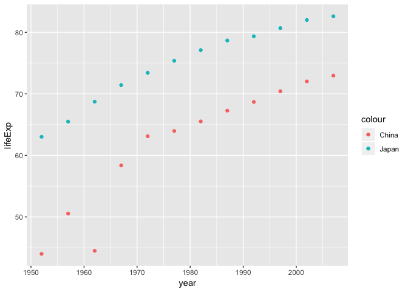
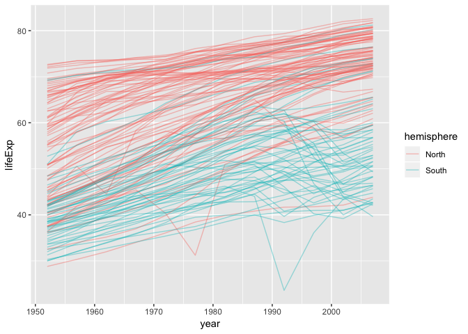

hw04
================

Hi! This is my homework 4 submission.

Content
-------

-   [Data Reshaping Prompt](#data-reshaping-prompt)
-   [Join Prompts](#join-prompts)

Load packages

``` r
suppressPackageStartupMessages(require(gapminder))
suppressPackageStartupMessages(require(tidyverse))
suppressPackageStartupMessages(require(knitr))
```

Data Reshaping Prompts
======================

Activity 2
----------

Take a glance of the dataset.

``` r
knitr::kable(head(gapminder))
```

| country     | continent |  year|  lifeExp|       pop|  gdpPercap|
|:------------|:----------|-----:|--------:|---------:|----------:|
| Afghanistan | Asia      |  1952|   28.801|   8425333|   779.4453|
| Afghanistan | Asia      |  1957|   30.332|   9240934|   820.8530|
| Afghanistan | Asia      |  1962|   31.997|  10267083|   853.1007|
| Afghanistan | Asia      |  1967|   34.020|  11537966|   836.1971|
| Afghanistan | Asia      |  1972|   36.088|  13079460|   739.9811|
| Afghanistan | Asia      |  1977|   38.438|  14880372|   786.1134|

Spread lifeExp across two asian countries: China and Japan.

``` r
china_vs_japan_lifeExp = gapminder %>% 
  filter(country %in% c("China","Japan")) %>% 
  select(lifeExp, country, year) %>% 
  spread(key=country,value=lifeExp)
knitr::kable(china_vs_japan_lifeExp)
```

|  year|     China|   Japan|
|-----:|---------:|-------:|
|  1952|  44.00000|  63.030|
|  1957|  50.54896|  65.500|
|  1962|  44.50136|  68.730|
|  1967|  58.38112|  71.430|
|  1972|  63.11888|  73.420|
|  1977|  63.96736|  75.380|
|  1982|  65.52500|  77.110|
|  1987|  67.27400|  78.670|
|  1992|  68.69000|  79.360|
|  1997|  70.42600|  80.690|
|  2002|  72.02800|  82.000|
|  2007|  72.96100|  82.603|

This has made it easy to make a scatterplot of these two countries' life expectancies.

``` r
ggplot(china_vs_japan_lifeExp, aes(year)) +
  geom_point(aes(y=China, color="China")) +
  geom_point(aes(y=Japan, color="Japan")) +
  labs(y = "lifeExp") 
```



Join Prompts
============

Activity 1
----------

See how many unique values.

``` r
unique(gapminder$continent)
```

    ## [1] Asia     Europe   Africa   Americas Oceania 
    ## Levels: Africa Americas Asia Europe Oceania

Make a dataset that contains hemisphere information of each continent.

``` r
hemisphere_info = tribble( ~continent, ~hemisphere, 
                           "Asia", "North",
                           "Europe", "North",
                           "Africa", "South",
                           "Americas", "North",
                           "Oceania", "South" )
(gapminder_with_hemisphere = right_join(hemisphere_info, gapminder, by="continent"))
```

    ## Warning: Column `continent` joining character vector and factor, coercing
    ## into character vector

    ## # A tibble: 1,704 x 7
    ##    continent hemisphere country      year lifeExp      pop gdpPercap
    ##    <chr>     <chr>      <fct>       <int>   <dbl>    <int>     <dbl>
    ##  1 Asia      North      Afghanistan  1952    28.8  8425333      779.
    ##  2 Asia      North      Afghanistan  1957    30.3  9240934      821.
    ##  3 Asia      North      Afghanistan  1962    32.0 10267083      853.
    ##  4 Asia      North      Afghanistan  1967    34.0 11537966      836.
    ##  5 Asia      North      Afghanistan  1972    36.1 13079460      740.
    ##  6 Asia      North      Afghanistan  1977    38.4 14880372      786.
    ##  7 Asia      North      Afghanistan  1982    39.9 12881816      978.
    ##  8 Asia      North      Afghanistan  1987    40.8 13867957      852.
    ##  9 Asia      North      Afghanistan  1992    41.7 16317921      649.
    ## 10 Asia      North      Afghanistan  1997    41.8 22227415      635.
    ## # ... with 1,694 more rows

We plot lifeExp each year colored by north or south hemisphere. We can see the north has in general higher lifeExpectancy than the south. Many countries in the south experienced sharpe decrease of lifeExp in the 90s.

``` r
ggplot(gapminder_with_hemisphere, aes(year, lifeExp)) + 
  geom_line(aes(group=country, color=hemisphere), alpha=0.4)
```



Have a good day!
